项目仓库：[Space3044/Pixel-Space](https://github.com/Space3044/Pixel-Space)

> **💡 推荐查阅：** 如需查询 Three.js API 和示例，请访问官方文档 👉 [Three.js Docs](https://threejs.org/docs/) [Three.js Manual](https://threejs.org/manual/) [Three.js Examples](https://threejs.org/examples/)

Pixel Space 的足迹页里有一个 Three.js 世界边界地球。它不是只放一个普通球体，而是把世界和中国的 GeoJSON 边界处理成 3D 线段，再用鼠标悬停识别国家或地区。本文主要介绍实现过程。

---

## 整体实现链路

这个地球组件要解决的不是“画一个球”，而是“把地理边界放到球面上，并且让鼠标能识别区域”。

```text
世界 / 中国 GeoJSON
  -> fetch 加载边界数据
  -> GeoJSON 整理边界线和命中索引
  -> Three.js 创建 Scene / Camera / Renderer
  -> SphereGeometry 生成地球主体
  -> LineSegments 生成国家和地区边界
  -> OrbitControls 控制旋转缩放
  -> Raycaster 命中球面
  -> 3D 坐标转经纬度
  -> GeoJSON 索引判断国家或地区
  -> 高亮鼠标悬停区域
```

后面的实现细节都围绕这条链路展开。

## 搭建练习项目和基础场景

### 搭好练习项目

正式动手前，先在项目的 `tmp/three-boundary-lab` 里准备一个独立练习场。

先写 `tmp/three-boundary-lab/package.json`：

```json
{
  "name": "three-boundary-lab",
  "private": true,
  "type": "module",
  "scripts": {
    "dev": "vite --host 127.0.0.1"
  },
  "dependencies": {
    "three": "^0.184.0"
  },
  "devDependencies": {
    "typescript": "^5.7.8",
    "vite": "^6.0.8"
  }
}
```

`private: true` 表示这个练习项目不发布到 npm。`type: "module"` 表示项目使用 ES Module 写法。`dependencies` 放浏览器运行时需要的包，`devDependencies` 放开发阶段使用的工具。

再写 `tmp/three-boundary-lab/index.html`：

```html
<!doctype html>
<html lang="zh-CN">
  <head>
    <meta charset="UTF-8" />
    <meta name="viewport" content="width=device-width, initial-scale=1.0" />
    <title>Three Boundary Lab</title>
    <link rel="stylesheet" href="/src/style.css" />
  </head>
  <body>
    <div id="app">
      <h1>Three Boundary Lab</h1>
      <div id="stage"></div>
    </div>

    <script type="module" src="/src/main.ts"></script>
  </body>
</html>
```

`#app` 是整个练习页面，`#stage` 是 Three.js 画地球的位置。`type="module"` 让浏览器按模块脚本加载入口，Vite 会从 `src/main.ts` 开始处理代码。

再写 `tmp/three-boundary-lab/src/style.css`：

```css
html,
body {
  margin: 0;
  min-height: 100%;
  background: #0d1117;
  color: #e6edf3;
  font-family: Arial, sans-serif;
}

#app {
  min-height: 100vh;
  padding: 24px;
  box-sizing: border-box;
}

h1 {
  margin: 0 0 16px;
  font-size: 24px;
}

#stage {
  width: min(100%, 960px);
  height: 560px;
  border: 1px solid #30363d;
  background: #020617;
  display: grid;
  place-items: center;
  color: #8b949e;
}
```

最后先写一个最小的 `tmp/three-boundary-lab/src/main.ts`：

```ts
const stage = document.querySelector<HTMLDivElement>('#stage');

if (!stage) {
  throw new Error('Stage element not found');
}

stage.textContent = 'Three.js stage ready';
```

启动练习项目：

```powershell
cd "tmp/three-boundary-lab"
pnpm install
pnpm dev
```

页面能看到 `Three.js stage ready`，说明页面入口、样式文件、TS 入口和 `#stage` 容器已经连通。

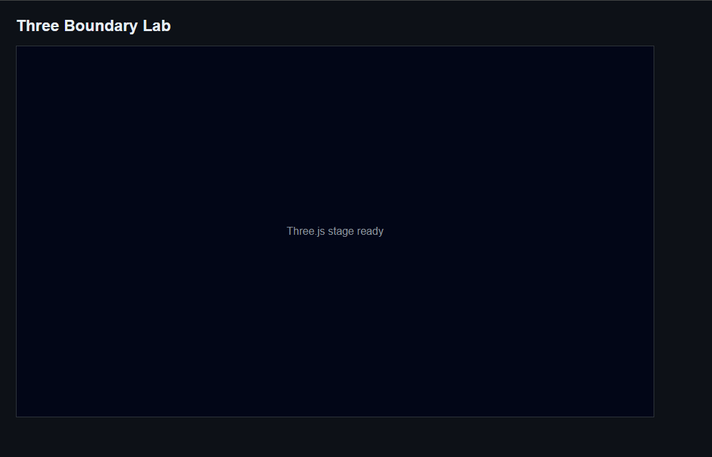

### 初始化 Three.js 地球

这一阶段先把 Three.js 画布和地球主体搭出来。地球创建逻辑单独放到 `globe.ts`，`main.ts` 只负责组装。

新建 `tmp/three-boundary-lab/src/globe.ts`：

```ts
import * as THREE from 'three';

export const createGlobe = (radius: number) => {
  const geometry = new THREE.SphereGeometry(radius, 64, 64);

  const globeMaterial = new THREE.MeshBasicMaterial({
    color: '#1d4ed8',
    transparent: true,
    opacity: 0.22,
  });
  const globe = new THREE.Mesh(geometry, globeMaterial);

  const wireMaterial = new THREE.MeshBasicMaterial({
    color: '#60a5fa',
    wireframe: true,
    transparent: true,
    opacity: 0.18,
  });
  const wireGlobe = new THREE.Mesh(geometry, wireMaterial);

  return { globe, wireGlobe };
};
```

然后修改 `tmp/three-boundary-lab/src/main.ts`。先在顶部新增导入：

```ts
import * as THREE from 'three';
import { createGlobe } from './globe';
```

保留原来的 `stage` 查询和空值判断：

```ts
const stage = document.querySelector<HTMLDivElement>('#stage');

if (!stage) {
  throw new Error('Stage element not found');
}
```

再把原来的占位文字：

```ts
stage.textContent = 'Three.js stage ready';
```

替换成 Three.js 场景、相机、渲染器和地球组：

```ts
const scene = new THREE.Scene();
scene.background = new THREE.Color('#020617');

const camera = new THREE.PerspectiveCamera(
  45,
  stage.clientWidth / stage.clientHeight,
  0.1,
  100,
);
camera.position.set(0, 0, 5);

const renderer = new THREE.WebGLRenderer({ antialias: true });
renderer.setSize(stage.clientWidth, stage.clientHeight);
renderer.setPixelRatio(window.devicePixelRatio);

const globeRadius = 1.5;
const { globe, wireGlobe } = createGlobe(globeRadius);

const globeGroup = new THREE.Group();
globeGroup.add(globe);
globeGroup.add(wireGlobe);
scene.add(globeGroup);

stage.appendChild(renderer.domElement);
renderer.render(scene, camera);
```

`Scene` 是场景，`Camera` 决定从哪里看，`Renderer` 把画面渲染到浏览器的 `canvas`。`Group` 是对象容器，球面和线框先放进 `globeGroup`，后面边界线也会放进去。

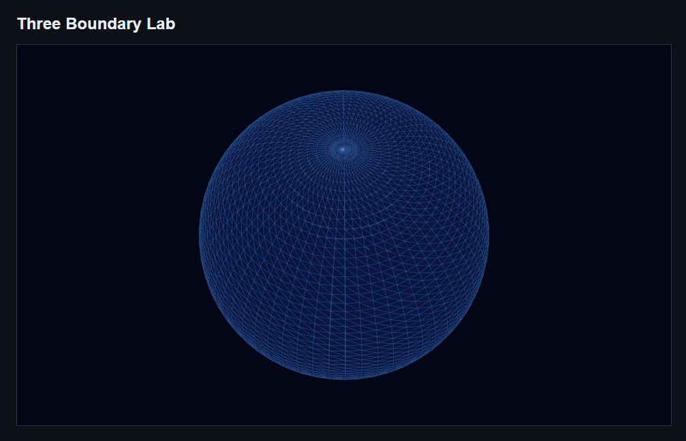

### 加入动画和鼠标控制

这一阶段继续改 `main.ts`。加上 `OrbitControls` 后，鼠标可以拖动和缩放地球；加上动画循环后，控制器的阻尼效果会持续更新。

在 `main.ts` 顶部新增导入：

```ts
import { OrbitControls } from 'three/examples/jsm/controls/OrbitControls.js';
```

把最后一行：

```ts
renderer.render(scene, camera);
```

替换成：

```ts
const controls = new OrbitControls(camera, renderer.domElement);
controls.enableDamping = true;

const animate = () => {
  controls.update();
  renderer.render(scene, camera);
  requestAnimationFrame(animate);
};

animate();
```

`requestAnimationFrame(animate)` 会让浏览器在下一帧继续执行 `animate`。`controls.update()` 用来更新鼠标控制器状态。

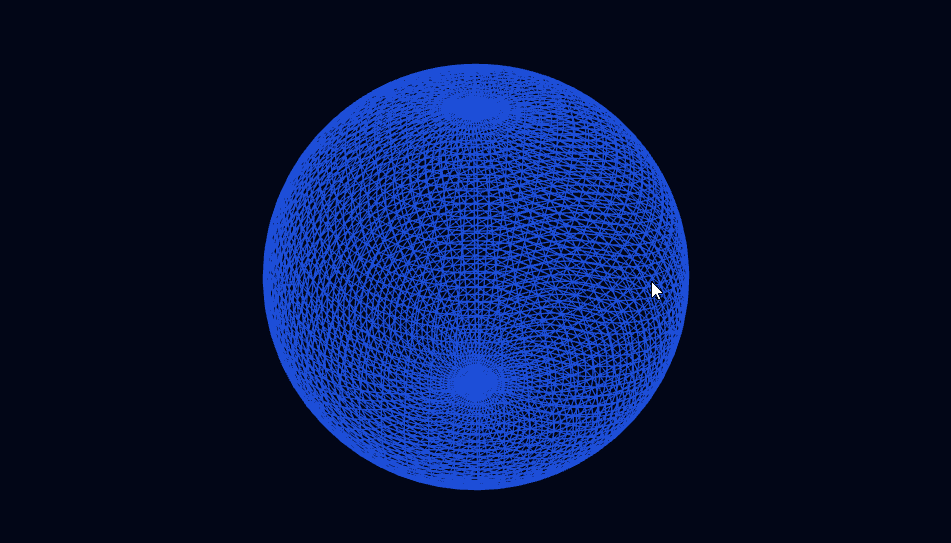

## 从经纬度到真实边界

边界数据是经纬度，Three.js 需要三维坐标。这一阶段先写坐标转换函数，再用模拟数据验证线条能画到球面上。

### 从经纬度画边界线

新建 `tmp/three-boundary-lab/src/geo.ts`：

```ts
import * as THREE from 'three';

export type LngLat = [lng: number, lat: number];

export const lngLatToVector3 = (lng: number, lat: number, radius: number) => {
  const phi = THREE.MathUtils.degToRad(90 - lat);
  const theta = THREE.MathUtils.degToRad(lng + 180);

  return new THREE.Vector3(
    -radius * Math.sin(phi) * Math.cos(theta),
    radius * Math.cos(phi),
    radius * Math.sin(phi) * Math.sin(theta),
  );
};
```

`LngLat` 表示 `[经度, 纬度]`，和 GeoJSON 的坐标顺序一致。`lngLatToVector3` 把一个经纬度点换成球面上的三维点。

继续修改 `globe.ts`。先在顶部新增导入：

```ts
import { lngLatToVector3, type LngLat } from './geo';
```

再把 `createGlobeLine` 加到 `createGlobe` 后面：

```ts
export const createGlobeLine = (
  coordinates: LngLat[],
  color: string,
  radius: number,
) => {
  const points = coordinates.map(([lng, lat]) =>
    lngLatToVector3(lng, lat, radius),
  );

  const geometry = new THREE.BufferGeometry().setFromPoints(points);
  const material = new THREE.LineBasicMaterial({ color });

  return new THREE.Line(geometry, material);
};
```

`coordinates` 是一条经纬度线。函数先把每个点转成 `Vector3`，再用 `THREE.Line` 按顺序连起来。

在 `main.ts` 里，先把原来的导入：

```ts
import { createGlobe } from './globe';
```

替换成：

```ts
import { createGlobe, createGlobeLine } from './globe';
```

再新增 `LngLat` 类型导入：

```ts
import type { LngLat } from './geo';
```

然后在 `globeRadius` 后面新增线条半径和赤道坐标：

```ts
const lineRadius = globeRadius + 0.02;

const equatorCoordinates: LngLat[] = Array.from(
  { length: 37 },
  (_, index) => [-180 + index * 10, 0],
);
```

最后在 `scene.add(globeGroup)` 前面加入赤道线：

```ts
const equatorLine = createGlobeLine(equatorCoordinates, '#f8fafc', lineRadius);
globeGroup.add(equatorLine);
```

`lineRadius` 比地球半径大一点，让线略高于球面，避免和球面重叠闪烁。

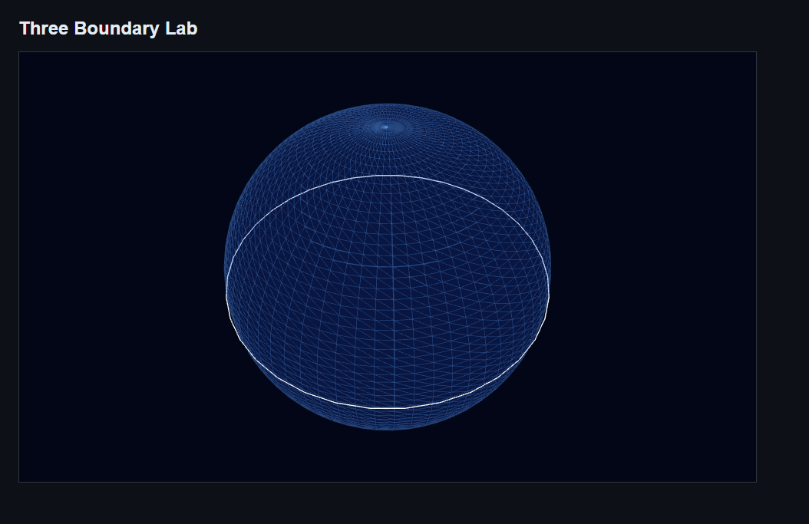

接着把赤道线数据换成更接近 GeoJSON 的 `Polygon.coordinates` 结构。在 `main.ts` 里，把原来的赤道坐标：

```ts
const equatorCoordinates: LngLat[] = Array.from(
  { length: 37 },
  (_, index) => [-180 + index * 10, 0],
);
```

替换成：

```ts
const polygonCoordinates: LngLat[][] = [
  [
    [95, 35],
    [105, 43],
    [118, 39],
    [116, 28],
    [104, 22],
    [94, 30],
    [95, 35],
  ],
];
```

`LngLat[]` 表示一条线，`LngLat[][]` 表示一组线。这里外层数组对应 `Polygon.coordinates`，里面的每个 `ring` 才是一条可以画出来的线。

再把赤道线代码：

```ts
const equatorLine = createGlobeLine(equatorCoordinates, '#f8fafc', lineRadius);
globeGroup.add(equatorLine);
```

替换成：

```ts
const polygonLines = polygonCoordinates.map((ring) =>
  createGlobeLine(ring, '#f8fafc', lineRadius),
);

globeGroup.add(...polygonLines);
```

这一步之后，页面上显示的是模拟的 Polygon 边界线。

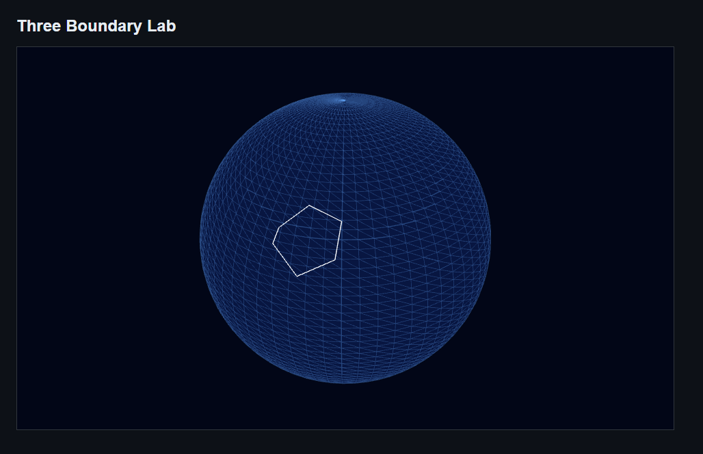

### 接入真实 GeoJSON 并画河北

真实数据来自 Pixel Space 仓库的 [public/maps](https://github.com/Space3044/Pixel-Space/tree/main/public/maps)。

```text
china.json    https://github.com/Space3044/Pixel-Space/blob/main/public/maps/china.json
world.zh.json https://github.com/Space3044/Pixel-Space/blob/main/public/maps/world.zh.json
```

这一阶段先写一个 GeoJSON 工具文件，把真实数据整理成前面已经能画的 `LngLat[][]`。

新建 `tmp/three-boundary-lab/src/geojson.ts`：

```ts
import type { LngLat } from './geo';

type PolygonCoordinates = LngLat[][];
type MultiPolygonCoordinates = LngLat[][][];

type PolygonGeometry = {
  type: 'Polygon';
  coordinates: PolygonCoordinates;
};

type MultiPolygonGeometry = {
  type: 'MultiPolygon';
  coordinates: MultiPolygonCoordinates;
};

type GeoJsonGeometry = PolygonGeometry | MultiPolygonGeometry;

type GeoJsonFeature = {
  type: 'Feature';
  properties: {
    name: string;
  };
  geometry: GeoJsonGeometry;
};

export type GeoJsonFeatureCollection = {
  type: 'FeatureCollection';
  features: GeoJsonFeature[];
};

const getGeometryRings = (geometry: GeoJsonGeometry): LngLat[][] => {
  if (geometry.type === 'Polygon') {
    return geometry.coordinates;
  }

  return geometry.coordinates.flat();
};

export const getFeatureRingsByName = (
  geoJson: GeoJsonFeatureCollection,
  featureName: string,
): LngLat[][] => {
  const feature = geoJson.features.find(
    (item) => item.properties.name === featureName,
  );

  if (!feature) {
    throw new Error(`Feature not found: ${featureName}`);
  }

  return getGeometryRings(feature.geometry);
};
```

`GeoJsonFeatureCollection` 是 GeoJSON 地理要素集合。`features` 是地理要素列表，在 `china.json` 里就是省级区域列表。`Polygon` 是一个多边形，`MultiPolygon` 是多个多边形。`getFeatureRingsByName` 会按名称找到省份，并统一返回 `LngLat[][]`。

河北在这份数据里是 `MultiPolygon`，包含 4 个 Polygon，每个 Polygon 里有 1 条 ring。一个 `ring` 可以理解成一条闭合边界线，所以完整河北需要 4 条 ring 一起画出来。

先删除 `main.ts` 里模拟数据用到的类型导入：

```ts
import type { LngLat } from './geo';
```

再新增 GeoJSON 工具导入：

```ts
import {
  getFeatureRingsByName,
  type GeoJsonFeatureCollection,
} from './geojson';
```

然后把原来的模拟 Polygon 数据：

```ts
const polygonCoordinates: LngLat[][] = [
  [
    [95, 35],
    [105, 43],
    [118, 39],
    [116, 28],
    [104, 22],
    [94, 30],
    [95, 35],
  ],
];
```

替换成真实数据读取逻辑。先只画河北第一条 ring：

```ts
const chinaJsonUrl = new URL('./data/china.json', import.meta.url);
const chinaResponse = await fetch(chinaJsonUrl);
const chinaGeoJson = (await chinaResponse.json()) as GeoJsonFeatureCollection;
const hebeiRings = getFeatureRingsByName(chinaGeoJson, '河北');
const polygonCoordinates = [hebeiRings[0]];
```

`polygonLines` 这段继续保留，还是负责把 `polygonCoordinates` 里的每条 ring 画成线：

```ts
const polygonLines = polygonCoordinates.map((ring) =>
  createGlobeLine(ring, '#f8fafc', lineRadius),
);
```

`new URL('./data/china.json', import.meta.url)` 得到当前模块旁边的 JSON 文件地址。`fetch` 读取这个文件。`chinaResponse.json()` 把响应内容解析成 JS 对象。`as GeoJsonFeatureCollection` 告诉 TS：这份 JSON 按 `GeoJsonFeatureCollection` 的结构来理解。

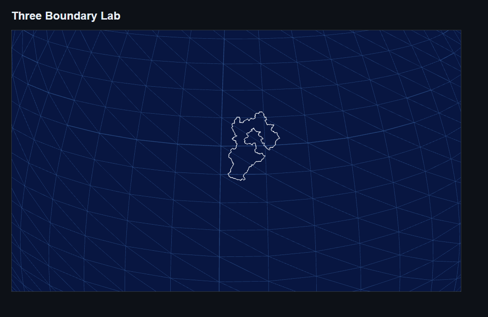

确认第一条 ring 能画出来后，把：

```ts
const polygonCoordinates = [hebeiRings[0]];
```

替换成：

```ts
const polygonCoordinates = hebeiRings;
```

这样 `polygonLines` 会为河北的每条 ring 创建一条 `THREE.Line`，完整河北边界就画出来了。

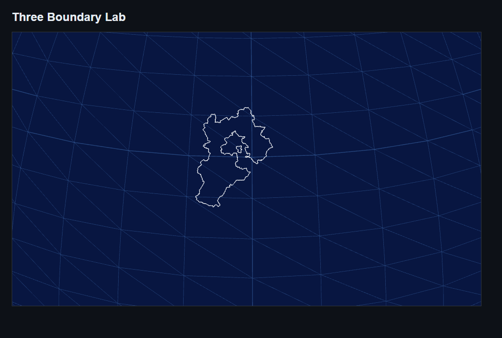

### 画完整中国边界

上一节只画了河北。现在要画完整中国边界，就不能只按名称找一个 `feature`，而是要遍历 `china.json.features`，把每个省级要素的边界都转成线。

这里先看几个坐标层级。`LngLat` 是一个点，`LineString` 是一条线，后面的 `MultiLineString`、`Polygon`、`MultiPolygon` 才是 GeoJSON 里常见的边界结构。

```text
LngLat
  [lng, lat]

LineString
  [[lng, lat], [lng, lat], [lng, lat]]

MultiLineString
  [
    [[lng, lat], [lng, lat]],
    [[lng, lat], [lng, lat]]
  ]

Polygon
  [
    [[lng, lat], [lng, lat], [lng, lat]]
  ]

MultiPolygon
  [
    [
      [[lng, lat], [lng, lat], [lng, lat]]
    ],
    [
      [[lng, lat], [lng, lat], [lng, lat]]
    ]
  ]
```

`MultiLineString` 是多条线，适合表示不封闭的边界线，比如 `china.json` 里的 `十段线`。`Polygon` 是一块区域，里面的每个 `ring` 都是一条闭合边界线。`MultiPolygon` 是多块区域，比如一个省份被拆成多个部分，或者包含岛屿、飞地。

`createGlobeLine` 每次只能画一条线，也就是 `LngLat[]`。所以这一节要把 `Polygon`、`MultiPolygon`、`MultiLineString` 都整理成统一的 `LngLat[][]`。

先修改 `tmp/three-boundary-lab/src/geojson.ts`。

在坐标类型这里，新增 `MultiLineStringCoordinates`：

```ts
type MultiLineStringCoordinates = LngLat[][];
```

在 `MultiPolygonGeometry` 后面，新增 `MultiLineStringGeometry`：

```ts
type MultiLineStringGeometry = {
  type: 'MultiLineString';
  coordinates: MultiLineStringCoordinates;
};
```

把 `GeoJsonGeometry` 替换成三种结构的联合类型：

```ts
type GeoJsonGeometry =
  | PolygonGeometry
  | MultiPolygonGeometry
  | MultiLineStringGeometry;
```

把 `getGeometryRings` 替换成下面这样：

```ts
const getGeometryRings = (geometry: GeoJsonGeometry): LngLat[][] => {
  if (geometry.type === 'Polygon') {
    return geometry.coordinates;
  }

  if (geometry.type === 'MultiPolygon') {
    return geometry.coordinates.flat();
  }

  return geometry.coordinates;
};
```

最后在文件末尾新增 `getAllFeatureRings`：

```ts
export const getAllFeatureRings = (
  geoJson: GeoJsonFeatureCollection,
): LngLat[][] => {
  return geoJson.features.flatMap((feature) =>
    getGeometryRings(feature.geometry),
  );
};
```

`Polygon` 的 `coordinates` 本来就是 `LngLat[][]`，可以直接返回。`MultiPolygon` 是 `LngLat[][][]`，需要 `flat()` 一层，变成 `LngLat[][]`。`MultiLineString` 本来也是 `LngLat[][]`，不能再 `flat()`，否则一条线会被压成单个点。

再修改 `tmp/three-boundary-lab/src/main.ts`。先把原来的导入：

```ts
import {
  getFeatureRingsByName,
  type GeoJsonFeatureCollection,
} from './geojson';
```

替换成：

```ts
import {
  getAllFeatureRings,
  type GeoJsonFeatureCollection,
} from './geojson';
```

然后把上一节读取河北的代码：

```ts
const chinaJsonUrl = new URL('./data/china.json', import.meta.url);
const chinaResponse = await fetch(chinaJsonUrl);
const chinaGeoJson = (await chinaResponse.json()) as GeoJsonFeatureCollection;
const hebeiRings = getFeatureRingsByName(chinaGeoJson, '河北');
const polygonCoordinates = hebeiRings;

const polygonLines = polygonCoordinates.map((ring) =>
  createGlobeLine(ring, '#f8fafc', lineRadius),
);
```

替换成异步加载完整中国边界：

```ts
const loadChinaBoundary = async () => {
  const chinaJsonUrl = new URL('./data/china.json', import.meta.url);
  const chinaResponse = await fetch(chinaJsonUrl);
  const chinaGeoJson = (await chinaResponse.json()) as GeoJsonFeatureCollection;
  const chinaRings = getAllFeatureRings(chinaGeoJson);

  const chinaBoundaryLines = chinaRings.map((ring) =>
    createGlobeLine(ring, '#f8fafc', lineRadius),
  );

  globeGroup.add(...chinaBoundaryLines);
};

void loadChinaBoundary();
```

这段代码里，`loadChinaBoundary` 负责加载数据、整理边界、创建线条。`void loadChinaBoundary()` 表示调用这个异步函数，但这里不需要拿它的返回值。

因为线条要加到 `globeGroup` 里，所以 `globeGroup` 要先创建，再调用 `loadChinaBoundary`。这一步完成后，页面上应该能看到完整中国省级边界和十段线。

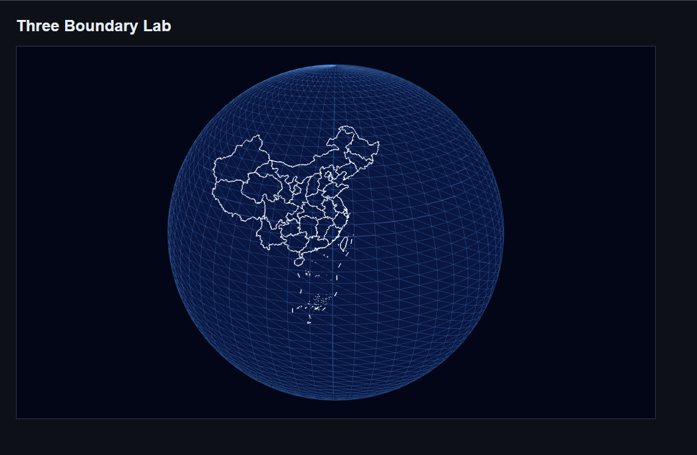

### 同时加载中国和世界边界

上一节的 `loadChinaBoundary` 只能加载中国边界。世界边界的加载方式一样，只是数据文件和颜色不同，所以这里先把它改成通用的 `loadBoundary`。

在 `tmp/three-boundary-lab/src/main.ts` 里，把：

```ts
const loadChinaBoundary = async () => {
  const chinaJsonUrl = new URL('./data/china.json', import.meta.url);
  const chinaResponse = await fetch(chinaJsonUrl);
  const chinaGeoJson = (await chinaResponse.json()) as GeoJsonFeatureCollection;
  const chinaRings = getAllFeatureRings(chinaGeoJson);

  const chinaBoundaryLines = chinaRings.map((ring) =>
    createGlobeLine(ring, '#f8fafc', lineRadius),
  );

  globeGroup.add(...chinaBoundaryLines);
};

void loadChinaBoundary();
```

替换成：

```ts
const loadBoundary = async (url: URL, color: string) => {
  const response = await fetch(url);
  const geoJson = (await response.json()) as GeoJsonFeatureCollection;
  const rings = getAllFeatureRings(geoJson);

  const boundaryLines = rings.map((ring) =>
    createGlobeLine(ring, color, lineRadius),
  );

  globeGroup.add(...boundaryLines);
};

const chinaJsonUrl = new URL('./data/china.json', import.meta.url);
const worldJsonUrl = new URL('./data/world.zh.json', import.meta.url);

void loadBoundary(chinaJsonUrl, '#f8fafc');
void loadBoundary(worldJsonUrl, '#f8fafc');
```

`url` 表示要读取哪个 GeoJSON 文件。`color` 表示这份边界线用什么颜色。这样中国边界和世界边界走同一套加载逻辑，只在调用时传不同参数。

这一步完成后，球面上会同时出现中国省级边界和世界国家边界。

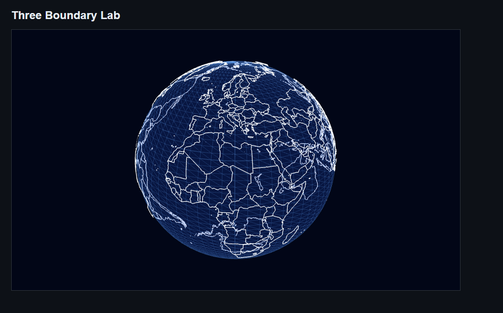

### 优化边界线绘制结构

现在的 `loadBoundary` 会遍历所有 `ring`，每条 `ring` 创建一个 `THREE.Line`：

```ts
const lines = rings.map((ring) =>
  createGlobeLine(ring, color, lineRadius),
);

globeGroup.add(...lines);
```

这样能画出来，但中国和世界边界的 `ring` 很多，最后会创建很多个 `THREE.Line` 对象。这里把同一份数据里的边界线合成一个 `THREE.LineSegments`：

```text
中国所有 ring -> 一个 LineSegments
世界所有 ring -> 一个 LineSegments
```

画面看起来仍然是很多边界线，但 Three.js 只需要管理更少的对象。

先修改 `tmp/three-boundary-lab/src/globe.ts`。在 `createGlobeLine` 后面新增：

```ts
export const createGlobeLineSegments = (
  rings: LngLat[][],
  color: string,
  radius: number,
) => {
  const points: THREE.Vector3[] = [];

  for (const ring of rings) {
    for (let index = 0; index < ring.length - 1; index += 1) {
      const [startLng, startLat] = ring[index];
      const [endLng, endLat] = ring[index + 1];

      points.push(lngLatToVector3(startLng, startLat, radius));
      points.push(lngLatToVector3(endLng, endLat, radius));
    }
  }

  const geometry = new THREE.BufferGeometry().setFromPoints(points);
  const material = new THREE.LineBasicMaterial({ color });

  return new THREE.LineSegments(geometry, material);
};
```

因为 `LineSegments` 会按两个点一组画线，所以这里不能把 `ring` 原样塞进去，而是要先把每条 `ring` 拆成一段一段的起点和终点：

```text
point0 -> point1
point1 -> point2
point2 -> point3
```

再修改 `tmp/three-boundary-lab/src/main.ts`。先把导入：

```ts
import { createGlobe, createGlobeLine } from './globe';
```

替换成：

```ts
import { createGlobe, createGlobeLineSegments } from './globe';
```

然后把 `loadBoundary` 里的这段：

```ts
const lines = rings.map((ring) =>
  createGlobeLine(ring, color, lineRadius),
);
globeGroup.add(...lines);
```

替换成：

```ts
const boundaryLines = createGlobeLineSegments(rings, color, lineRadius);
globeGroup.add(boundaryLines);
```

这样中国边界会生成一个 `LineSegments`，世界边界也会生成一个 `LineSegments`。

## 页面适配和鼠标交互

### 适配页面尺寸

现在 `renderer.setSize(stage.clientWidth, stage.clientHeight)` 只在初始化时执行一次。窗口尺寸变化后，画布和相机比例不会自动更新，地球可能被拉伸，或者画布尺寸和容器不一致。

在 `tmp/three-boundary-lab/src/main.ts` 里，找到渲染器初始化代码：

```ts
const renderer = new THREE.WebGLRenderer({ antialias: true });
renderer.setSize(stage.clientWidth, stage.clientHeight);
renderer.setPixelRatio(window.devicePixelRatio);
```

在它后面新增：

```ts
const resizeRenderer = () => {
  camera.aspect = stage.clientWidth / stage.clientHeight;
  camera.updateProjectionMatrix();

  renderer.setSize(stage.clientWidth, stage.clientHeight);
  renderer.setPixelRatio(window.devicePixelRatio);
};

window.addEventListener('resize', resizeRenderer);
```

`camera.aspect` 是相机的宽高比。容器尺寸变了，相机也要重新知道现在的比例。`camera.updateProjectionMatrix()` 会让相机的修改真正生效。`renderer.setSize` 会让 Three.js 画布重新匹配 `#stage` 的宽高。

这一步不会让页面多出新的图形。它的效果是窗口变宽或变窄时，地球仍然保持圆形，画布也会跟着容器尺寸重新渲染。

### 鼠标悬停识别区域

实现方式是一条基础的链路：

```text
鼠标位置
  -> Raycaster 命中地球球面
  -> 得到球面上的 3D 点
  -> 3D 点转回经纬度
  -> 后面再用经纬度判断国家或省份
```

这里会经过几套坐标系：

```text
浏览器窗口坐标
event.clientX / event.clientY
  鼠标在浏览器窗口里的位置，左上角是 0,0，向右和向下增大。

Canvas 标准设备坐标
mouse.x / mouse.y
  Three.js Raycaster 需要的二维坐标，范围是 -1 到 1。

Three.js 世界坐标
intersection.point.x / y / z
  射线命中地球后，命中点在 scene 里的三维位置。

地图经纬度坐标
lng / lat
  GeoJSON 使用的地理坐标，经度通常是 -180 到 180，纬度是 -90 到 90。
```

转换顺序是：

```text
event.clientX / event.clientY
  -> 减去 canvas 的 left/top，再除以 canvas 宽高
  -> 得到 mouse.x / mouse.y

mouse.x / mouse.y + camera
  -> raycaster.setFromCamera(mouse, camera)
  -> 生成一条从相机出发的射线

raycaster.intersectObject(globe, false)
  -> 射线命中地球
  -> 得到 intersection.point

vectorToLngLat(intersection.point.x, intersection.point.y, intersection.point.z)
  -> 把 Three.js 三维坐标转成 lng / lat
```

我们这里的拖拽旋转和滚轮缩放来自 `OrbitControls`，改变的是相机视角，不是地球对象本身。所以 `intersection.point` 可以直接传给 `vectorToLngLat`。

先完成前半段：鼠标悬停到地球上时，在地球下方显示当前经纬度。

先新建 `tmp/three-boundary-lab/src/geo-hit.ts`：

```ts
const normalizeLongitude = (lng: number) => {
  if (!Number.isFinite(lng)) return lng;
  return ((((lng + 180) % 360) + 360) % 360) - 180;
};

export const vectorToLngLat = (x: number, y: number, z: number) => {
  const radius = Math.hypot(x, y, z);
  if (!Number.isFinite(radius) || radius === 0) {
    return { lng: 0, lat: 0 };
  }

  const clampedY = Math.max(-1, Math.min(1, y / radius));
  const lat = (Math.asin(clampedY) * 180) / Math.PI;
  const theta = (Math.atan2(z, -x) * 180) / Math.PI;

  return {
    lng: normalizeLongitude(theta - 180),
    lat,
  };
};
```

`vectorToLngLat` 负责把 Three.js 里的三维坐标转回地图经纬度。`normalizeLongitude` 把经度整理到 `-180` 到 `180` 之间，方便后面和 GeoJSON 数据对齐。`clampedY` 是把 `y / radius` 限制在 `-1` 到 `1` 之间，避免浮点误差导致 `Math.asin` 算出无效值。

再修改 `tmp/three-boundary-lab/index.html`。把：

```html
<div id="stage"></div>
```

替换成：

```html
<figure id="globe">
  <div id="stage"></div>
  <figcaption id="hover-status">lng: -, lat: -</figcaption>
</figure>
```

这里的 `#stage` 仍然负责放 Three.js 画布，`#hover-status` 放在地球下方。后面识别出国家或省份后，也会继续复用这个位置显示名称。

继续修改 `tmp/three-boundary-lab/src/style.css`。新增：

```css
#globe {
  width: min(100%, 960px);
  margin: 0;
}

#hover-status {
  margin-top: 12px;
  min-height: 20px;
  color: #cbd5e1;
  font-family: monospace;
  font-size: 13px;
  text-align: center;
}
```

再把 `#stage` 的宽度从：

```css
width: min(100%, 960px);
```

改成：

```css
width: 100%;
```

这样外层 `#globe` 控制整体宽度，`#stage` 只填满地球画布区域。

最后修改 `tmp/three-boundary-lab/src/main.ts`。先新增导入：

```ts
import { vectorToLngLat } from './geo-hit';
```

在获取 `stage` 的地方，同时获取状态栏：

```ts
const stage = document.querySelector<HTMLDivElement>('#stage');
const hoverStatus = document.querySelector<HTMLElement>('#hover-status');
```

空值判断也补上：

```ts
if (!hoverStatus) {
  throw new Error('Hover status element not found');
}
```

在 `controls` 后面新增 Raycaster 和鼠标坐标：

```ts
const raycaster = new THREE.Raycaster();
const mouse = new THREE.Vector2();
```

继续新增鼠标移动逻辑：

```ts
const handleMouseMove = (event: MouseEvent) => {
  const rect = renderer.domElement.getBoundingClientRect();

  const x = ((event.clientX - rect.left) / rect.width) * 2 - 1;
  const y = -((event.clientY - rect.top) / rect.height) * 2 + 1;

  mouse.set(x, y);
  raycaster.setFromCamera(mouse, camera);

  const intersects = raycaster.intersectObject(globe, false);
  const intersection = intersects[0];

  if (!intersection) return;

  const { lng, lat } = vectorToLngLat(
    intersection.point.x,
    intersection.point.y,
    intersection.point.z,
  );

  hoverStatus.textContent = `lng: ${lng.toFixed(4)}, lat: ${lat.toFixed(4)}`;
};
```

这里的 `x` 和 `y` 不是普通页面坐标，而是 Three.js 需要的标准设备坐标，范围是 `-1` 到 `1`。浏览器页面的 `y` 轴是向下增加，Three.js 的标准坐标是向上为正，所以 `y` 前面要加负号。

再新增鼠标离开逻辑：

```ts
const handleMouseLeave = () => {
  hoverStatus.textContent = 'lng: -, lat: -';
};
```

最后绑定事件：

```ts
renderer.domElement.addEventListener('mousemove', handleMouseMove);
renderer.domElement.addEventListener('mouseleave', handleMouseLeave);
```

这一步完成后，鼠标移动到地球上时，地球下方会显示当前经纬度。鼠标离开画布后，状态栏恢复成 `lng: -, lat: -`。

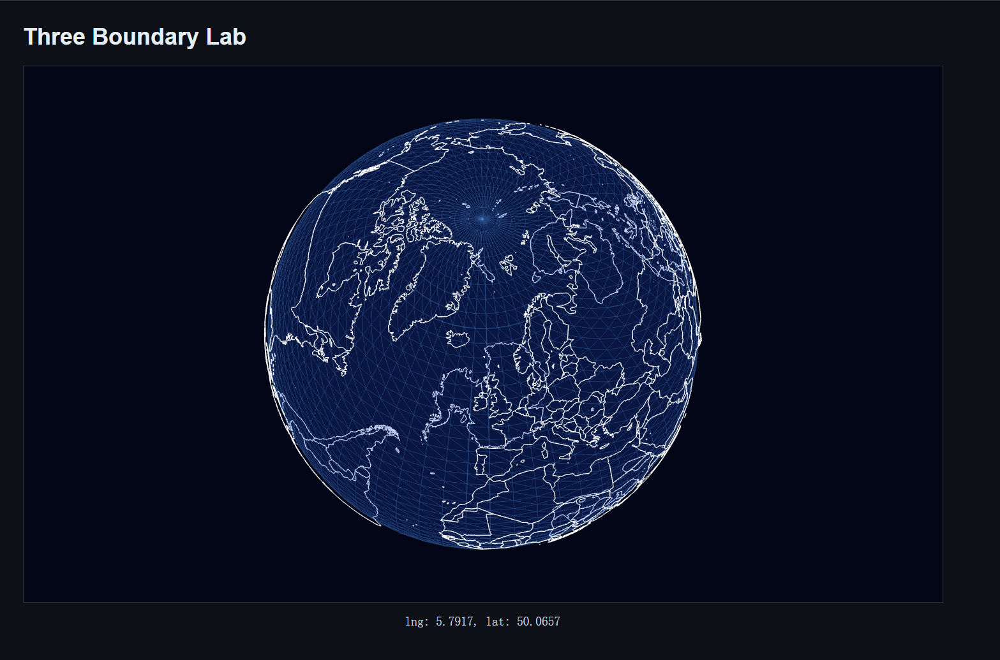

### 用经纬度判断区域名称

上一节只能得到鼠标所在位置的经纬度。下一步要把这个经纬度拿去和 GeoJSON 边界数据比较，判断它落在哪个国家或省份里。

这里继续完善 `tmp/three-boundary-lab/src/geo-hit.ts`。先定义命中判断要用的数据结构：

```ts
type Ring = LngLat[];
type Polygon = Ring[];

interface RegionPolygon {
  name: string;
  rings: Polygon;
  bbox: {
    minLng: number;
    maxLng: number;
    minLat: number;
    maxLat: number;
  };
  area: number;
}

export interface GeoHitIndex {
  regions: RegionPolygon[];
}
```

`Ring` 是一圈边界点。`Polygon` 是一块区域，里面可以有多个 `ring`。如果一个 `Polygon` 里有多个 `ring`，第一个通常是外边界，后面的通常是洞。

`RegionPolygon` 是我们自己整理出来的区域对象。它保留区域名、边界、外接矩形和面积。`GeoHitIndex` 则是所有可命中区域的列表。

接着写一个把 `Polygon` 整理成 `RegionPolygon` 的函数：

```ts
const buildRegionPolygon = (name: string, rings: Polygon): RegionPolygon | null => {
  const validRings = rings
    .map((ring) => ring.filter(isCoordinate))
    .filter((ring) => ring.length >= 3);

  if (validRings.length === 0) return null;

  let minLng = Number.POSITIVE_INFINITY;
  let maxLng = Number.NEGATIVE_INFINITY;
  let minLat = Number.POSITIVE_INFINITY;
  let maxLat = Number.NEGATIVE_INFINITY;

  for (const ring of validRings) {
    for (const [lng, lat] of ring) {
      minLng = Math.min(minLng, lng);
      maxLng = Math.max(maxLng, lng);
      minLat = Math.min(minLat, lat);
      maxLat = Math.max(maxLat, lat);
    }
  }

  const exteriorArea = polygonArea(validRings[0]);
  const holesArea = validRings
    .slice(1)
    .reduce((total, ring) => total + polygonArea(ring), 0);

  return {
    name,
    rings: validRings,
    bbox: { minLng, maxLng, minLat, maxLat },
    area: Math.max(exteriorArea - holesArea, 0),
  };
};
```

`validRings` 会过滤掉非法坐标和点数不够的边界。最大最小经纬度是遍历所有点得到的，后面可以用来快速排除不可能命中的区域。

`exteriorArea` 是外边界面积。`holesArea` 是内部洞的总面积。`slice(1)` 表示跳过第一个外边界，只取后面的洞；`reduce` 表示把这些洞的面积累加起来。

如果是一个 `Polygon` 里多个 `ring`，面积按下面的方式算：

```text
实际面积 = 外边界面积 - 洞面积
```

如果是 `MultiPolygon`，这里不会把多个区域合并成一个对象，而是拆成多个 `RegionPolygon` 放进数组。比如河北有多个独立区域时，`regions` 里会出现多个同名的 `中国-河北`，鼠标命中任意一块都会返回同一个名字。

这个拆分在 `addFeaturePolygons` 里完成：

```ts
const addFeaturePolygons = (
  regions: RegionPolygon[],
  feature: GeoJsonFeature,
  parentName?: string,
) => {
  const rawName = feature.properties?.name;
  if (typeof rawName !== 'string' || !rawName.trim()) return;

  const name = parentName
    ? `${parentName}-${rawName.trim()}`
    : rawName.trim();
  if (!parentName && name === '中国') return;

  const geometry = feature.geometry;
  if (!geometry) return;

  if (geometry.type === 'Polygon' && Array.isArray(geometry.coordinates)) {
    const polygon = buildRegionPolygon(name, geometry.coordinates as Polygon);
    if (polygon) regions.push(polygon);
    return;
  }

  if (geometry.type === 'MultiPolygon' && Array.isArray(geometry.coordinates)) {
    for (const rings of geometry.coordinates) {
      if (!Array.isArray(rings)) continue;

      const polygon = buildRegionPolygon(name, rings as Polygon);
      if (polygon) regions.push(polygon);
    }
  }
};
```

世界数据里的整体 `中国` 会被跳过，因为中国省份会从 `china.json` 里单独加入，名字会变成 `中国-北京`、`中国-河北` 这种形式。

再用 `buildGeoHitIndex` 把世界数据和中国数据整理成一个命中索引：

```ts
export const buildGeoHitIndex = (
  worldData: GeoJsonFeatureCollection,
  chinaData: GeoJsonFeatureCollection,
): GeoHitIndex => {
  const regions: RegionPolygon[] = [];

  for (const feature of collectFeatures(worldData)) {
    addFeaturePolygons(regions, feature);
  }

  for (const feature of collectFeatures(chinaData)) {
    addFeaturePolygons(regions, feature, '中国');
  }

  regions.sort((left, right) => left.area - right.area);

  return { regions };
};
```

`regions.sort((left, right) => left.area - right.area)` 会让小区域排在前面。后面鼠标判断时会按顺序找第一个命中的区域，小区域先判断，可以减少被大区域提前命中的情况。

最后是点和区域的判断。`isPointInsideRing` 判断一个经纬度点是否在一圈边界里面：

```ts
const isPointInsideRing = (lng: number, lat: number, ring: Ring) => {
  let inside = false;

  for (
    let index = 0, previous = ring.length - 1;
    index < ring.length;
    previous = index, index += 1
  ) {
    const [currentLng, currentLat] = ring[index];
    const [previousLng, previousLat] = ring[previous];

    const crosses = (currentLat > lat) !== (previousLat > lat);
    if (!crosses) continue;

    const intersectionLng =
      ((previousLng - currentLng) * (lat - currentLat)) /
        (previousLat - currentLat) +
      currentLng;

    if (lng < intersectionLng) inside = !inside;
  }

  return inside;
};
```

这段用的是射线法。这里的射线不是 Three.js 的 `Raycaster`，而是二维平面里的假想水平线。可以理解成从鼠标点向右画一条线：

```text
鼠标点 -------------------->
```

然后数这条线和边界相交了几次：

```text
相交 0 次：外面
相交 1 次：里面
相交 2 次：外面
相交 3 次：里面
```

所以代码里先用 `inside = false` 表示默认在外面。每发现一次有效相交，就执行一次：

```ts
inside = !inside;
```

也就是在“外面”和“里面”之间来回切换。

`crosses` 用来判断当前这条边界线段是否跨过鼠标点所在的水平线：

```ts
const crosses = (currentLat > lat) !== (previousLat > lat);
```

如果没有跨过，就跳过。跨过之后，再用 `intersectionLng` 算出交点的经度：

```ts
const intersectionLng =
  ((previousLng - currentLng) * (lat - currentLat)) /
    (previousLat - currentLat) +
  currentLng;
```

最后这句判断交点是不是在鼠标点右侧：

```ts
if (lng < intersectionLng) inside = !inside;
```

只有右侧交点才算一次有效相交。

`isPointInsidePolygon` 则判断一个点是否在完整区域里：

```ts
const isPointInsidePolygon = (
  lng: number,
  lat: number,
  polygon: RegionPolygon,
) => {
  const { bbox, rings } = polygon;

  if (
    lng < bbox.minLng ||
    lng > bbox.maxLng ||
    lat < bbox.minLat ||
    lat > bbox.maxLat
  ) {
    return false;
  }

  if (!isPointInsideRing(lng, lat, rings[0])) return false;

  return !rings.slice(1).some((ring) =>
    isPointInsideRing(lng, lat, ring),
  );
};
```

判断顺序是：

```text
先看点是否在外接矩形里
再看点是否在外边界里
最后看点是否落进洞里
```

所以一个点属于某个 `Polygon` 的条件是：它在外边界里面，并且不在任何洞里面。

为了让后面的 `main.ts` 能按区域名取边界，先继续在 `geo-hit.ts` 里新增一个函数。放在 `findRegionByLngLat` 后面：

```ts
export const getRegionRingsByName = (
  index: GeoHitIndex | null,
  name: string | null,
): Polygon => {
  if (!index || !name) return [];

  return index.regions
    .filter((region) => region.name === name)
    .flatMap((region) => region.rings);
};
```

这个函数会把同名区域的所有 `rings` 取出来。比如河北被拆成多个 `RegionPolygon`，这里会把这些同名区域的边界一起拿出来，后面统一画成高亮线。

最后把这个索引用到 `tmp/three-boundary-lab/src/main.ts` 里。

先把 `geo-hit.ts` 的导入从：

```ts
import { vectorToLngLat } from './geo-hit';
```

替换成：

```ts
import {
  buildGeoHitIndex,
  findRegionByLngLat,
  getRegionRingsByName,
  vectorToLngLat,
  type GeoHitIndex,
} from './geo-hit';
```

高亮边界要比普通边界再稍微高一点，所以在 `lineRadius` 后面新增：

```ts
const hoverLineRadius = globeRadius + 0.04;
```

然后在 `scene.add(globeGroup)` 后面新增几个变量，保存命中索引和当前高亮边界：

```ts
let hitIndex: GeoHitIndex | null = null;
let hoveredRegionName: string | null = null;
let hoveredBoundary: THREE.LineSegments | null = null;
```

再新增两个函数，负责清掉旧高亮和设置新高亮：

```ts
const clearHoveredBoundary = () => {
  if (!hoveredBoundary) return;

  globeGroup.remove(hoveredBoundary);
  hoveredBoundary.geometry.dispose();

  if (Array.isArray(hoveredBoundary.material)) {
    for (const material of hoveredBoundary.material) {
      material.dispose();
    }
  } else {
    hoveredBoundary.material.dispose();
  }

  hoveredBoundary = null;
};

const setHoveredRegion = (regionName: string | null) => {
  if (regionName === hoveredRegionName) return;

  clearHoveredBoundary();
  hoveredRegionName = regionName;

  const rings = getRegionRingsByName(hitIndex, regionName);
  if (rings.length === 0) return;

  hoveredBoundary = createGlobeLineSegments(
    rings,
    '#facc15',
    hoverLineRadius,
  );
  globeGroup.add(hoveredBoundary);
};
```

`hoveredRegionName` 用来避免鼠标在同一个区域内移动时反复重画。`hoveredBoundary` 是额外加到 `globeGroup` 里的高亮线。清理时要从场景里移除，也要释放 `geometry` 和 `material`。

之前的 `loadBoundary` 只负责画边界线。现在同一份 `china.json` 和 `world.zh.json` 还要拿来构建命中索引，所以删除 `loadBoundary` 函数、`chinaJsonUrl`、`worldJsonUrl` 和两个 `void loadBoundary(...)` 调用，换成 `loadMapData`：

```ts
const loadMapData = async () => {
  const chinaJsonUrl = new URL('./data/china.json', import.meta.url);
  const worldJsonUrl = new URL('./data/world.zh.json', import.meta.url);

  const [chinaResponse, worldResponse] = await Promise.all([
    fetch(chinaJsonUrl),
    fetch(worldJsonUrl),
  ]);

  const [chinaGeoJson, worldGeoJson] = await Promise.all([
    chinaResponse.json() as Promise<GeoJsonFeatureCollection>,
    worldResponse.json() as Promise<GeoJsonFeatureCollection>,
  ]);

  hitIndex = buildGeoHitIndex(worldGeoJson, chinaGeoJson);

  const chinaRings = getAllFeatureRings(chinaGeoJson);
  const worldRings = getAllFeatureRings(worldGeoJson);

  globeGroup.add(createGlobeLineSegments(chinaRings, '#f8fafc', lineRadius));
  globeGroup.add(createGlobeLineSegments(worldRings, '#f8fafc', lineRadius));
};

void loadMapData();
```

这里的 `Promise.all` 是并发请求。中国数据和世界数据互不依赖，可以一起加载。加载完成后，这两份 JSON 会做两件事：

```text
getAllFeatureRings
  用来画边界线

buildGeoHitIndex
  用来给鼠标悬停判断区域名
```

最后修改 `handleMouseMove`。原来得到经纬度后，只显示 `lng / lat`：

```ts
hoverStatus.textContent = `lng: ${lng.toFixed(4)}, lat: ${lat.toFixed(4)}`;
```

先把原来的未命中判断：

```ts
if (!intersection) return;
```

替换成：

```ts
if (!intersection) {
  setHoveredRegion(null);
  hoverStatus.textContent = 'lng: -, lat: -';
  return;
}
```

这样鼠标还在画布里、但没有落到地球球面上时，也会清掉上一块区域的高亮。

现在改成先查区域名：

```ts
const regionName = findRegionByLngLat(hitIndex, lat, lng);

setHoveredRegion(regionName);
hoverStatus.textContent =
  regionName ?? `lng: ${lng.toFixed(4)}, lat: ${lat.toFixed(4)}`;
```

`findRegionByLngLat` 如果找到了区域，就返回区域名，比如 `中国-河北`。`setHoveredRegion` 会用这个名字找到同名边界，再画一层黄色高亮线。如果没找到区域，就清掉高亮，页面继续显示经纬度。

鼠标离开画布时，也要清掉高亮：

```ts
const handleMouseLeave = () => {
  setHoveredRegion(null);
  hoverStatus.textContent = 'lng: -, lat: -';
};
```

到这里，鼠标悬停识别的链路就完整了：

```text
鼠标位置
  -> Raycaster 命中地球
  -> intersection.point
  -> vectorToLngLat 得到经纬度
  -> findRegionByLngLat 查 GeoJSON 区域
  -> getRegionRingsByName 取同名区域边界
  -> createGlobeLineSegments 画高亮边界
  -> 显示国家或省份名称
```

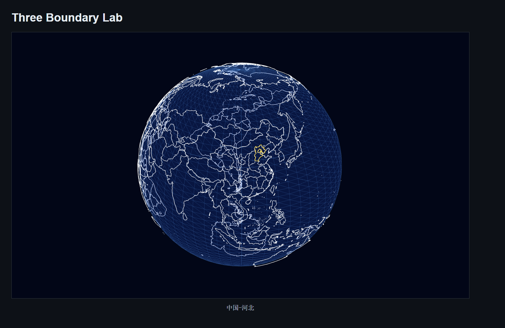

至此，我们已经完成了一个可交互的足迹地球。它可以加载真实的中国和世界边界，也可以通过鼠标悬停识别所在区域，并把对应边界高亮出来。
